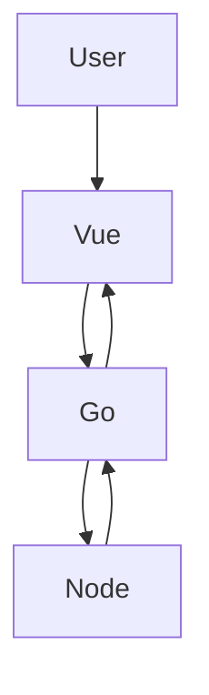

# Matrix QR Decomposition Frontend

SPA en Vue 3 + TypeScript para enviar matrices al microservicio Go, visualizar Q/R y presentar las estadisticas calculadas por Node.js.

## Arquitectura



El frontend solo habla con Go. Go calcula la factorizacion QR, envia `q` y `r` a Node para analisis estadistico y devuelve la respuesta completa al navegador.

## Instalacion local

```bash
npm install
copy .env.example .env
npm run dev
```

La aplicacion queda disponible en `http://localhost:5173`.

## Variables de entorno

- `VITE_GO_API_URL`: URL base del microservicio Go. Por defecto documentado: `http://localhost:3000`.
- `VITE_GO_API_PATH`: ruta de calculo; por defecto `/api/v1/matrix/qr`.
- `VITE_JWT_TOKEN`: JWT Bearer que se enviara a Go. Vite inyecta estas variables durante el build.

Para pruebas locales, configura un token JWT valido en `.env`:

```text
VITE_JWT_TOKEN=eyJhbGciOiJIUzI1NiIs...
```

## Docker

Desde esta carpeta:

```bash
docker compose up --build
```

- Frontend: `http://localhost:5173`
- Go API: `http://localhost:3000`
- Node API: `http://localhost:4000`

El argumento `VITE_GO_API_URL` se fija en el build a `http://localhost:3000`, porque las peticiones del navegador salen del host. Go usa internamente `http://node-api:4000/api/v1/stats`.

## Endpoint utilizado

```text
POST ${VITE_GO_API_URL}${VITE_GO_API_PATH}
Authorization: Bearer <JWT>
Content-Type: application/json
```

Body:

```json
[[1, 2], [3, 4], [5, 6]]
```

Respuesta esperada:

```json
{
  "q": [[...]],
  "r": [[...]],
  "analysis": {
    "min": -1,
    "max": 2,
    "average": 0.42,
    "sum": 3,
    "hasDiagonalMatrix": false
  }
}
```

## Estructura

- `src/components`: input, tablas, estadisticas, flujo y errores.
- `src/services/goApi.ts`: unica capa Axios.
- `src/stores/matrix.store.ts`: estado y ciclo de request con Pinia.
- `src/views`: pantalla principal.
- `src/types`: contratos TypeScript.
- `Dockerfile` + `nginx.conf`: build Vite y servidor estatico de produccion.

## Decisiones tecnicas

- Composition API y `strict: true` para contratos claros.
- Vuetify para controles accesibles y responsive.
- Matrices editables con scroll horizontal en pantallas pequenas.
- La validacion ocurre antes de enviar y los errores de red se traducen a mensajes de usuario sin stack traces.
- El backend Go mantiene `/api/v1/matrix/qr` y ofrece el alias `/api/v1/matrix/qr` para el contrato del frontend.
